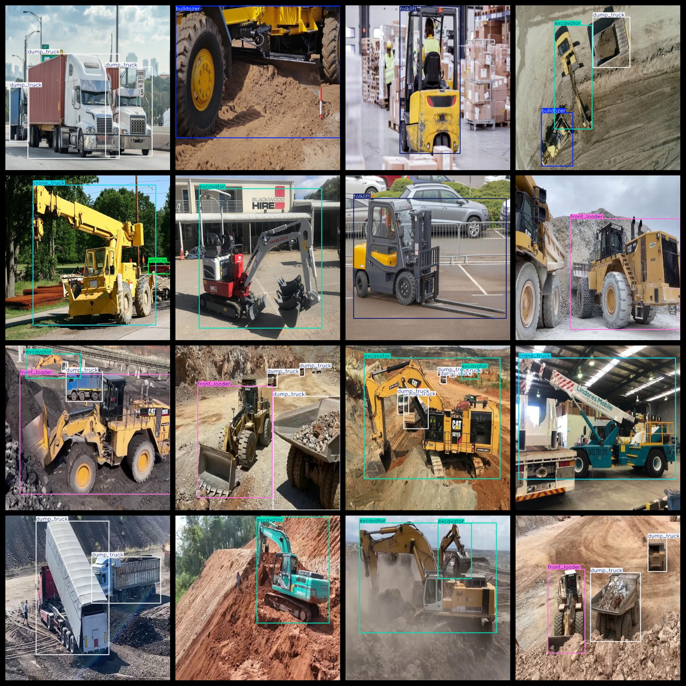
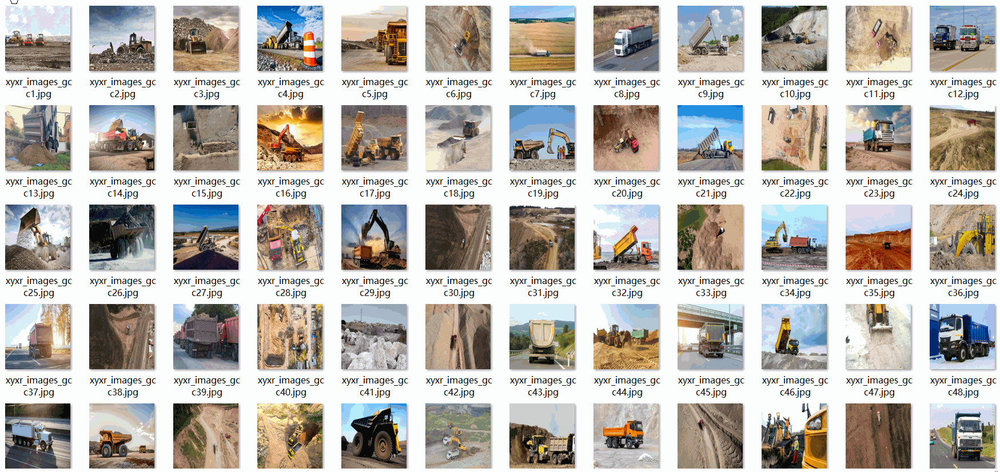

# Construction Site Heavy Machinery Engineering Vehicle Detection Dataset 5296 images VOC+YOLO format

The dataset consists of 5296 images captured by a heavy machinery inspection vehicle during construction site operations. The images are in Pascal VOC format and YOLO format (excluding the segmentation path, only containing JPG images and their corresponding VOC format XML files and YOLO format TXT files).

Number of images: 5296 jpg images

Number of annotations: 5296 xml files

Number of annotations: 5296 txt files

Number of annotation categories: 9

GitHub repository: datasets_sl

List of vehicle categories: ["bulldozer", "crane_truck", "dump_truck", "excavator", "folklift", "front_loader", "tower_crane", "truck", "vehicle"]

Tags: bulldozers, cranes, trucks, dump trucks, excavators, forklifts, front-loaders, tower cranes, trucks, vehicles

Number of boxes labeled in each category:

- bulldozer frame count = 780
- crane_truck frame count = 603
- dump_truck frame count = 3844
- excavator frame count = 2273
- folklift frame count = 491
- front_loader frame count = 1156
- tower_crane frame count = 378
- truck frame count = 92
- vehicle frame count = 57

Total frames: 9674

Number of images per category:

- bulldozer occupancy: 692
- crane_truck occupies a total of 537 images.
- 2124
- excavator occupies 1971 pictures
- folklift occupies a total of 462 images.
- front_loader occupies 1096 images
- Tower Crane occupies 258 images
- truck occupies a total of 81 images.
- Vehicle possession count: 27

Image resolution: 640x640

Use the labeling tool: labelImg

The dataset has not been augmented.

Marking rules: Draw a rectangular box around the category.

Important note: The dataset has not been split into training, validation, and test sets, so it needs to be manually divided.

Special Disclaimer: This dataset does not guarantee the accuracy of the trained model or weight files.
## Images

---

Here is a pay link on Stripe (https://buy.stripe.com/3cs8yP7sY87d0vu9AB). Please contact me lonlonago@foxmail.com after funding $89, and I will send you a complete data files, thank you!

